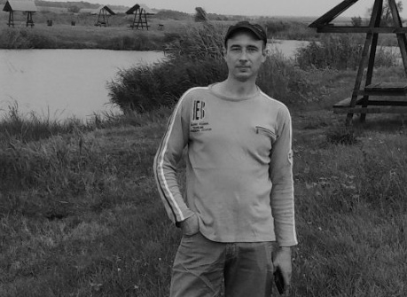

***


# Eduard Rusakovich


***


## Contacts

* Discord: Эдуард#3890(@jastreb2015)
* Telegram:  https://t.me/eduardrusakovich
* E-mail: varvarkonan@aol.com
* Location: Saratov, Russian Federation

***


## About me

> "The two most important days in your life are the day you are born and the day you find out why." Mark Twain

I want to be FrontEnd Developer.


***


## Skills

1. Javascript
2. HTML/CSS
3. Figma
4. Git, GitBash
5. WordPress
6. VS Code
7. PhotoShop
***


## Code Example

```
function multiply(a, b){
  return a * b;
}

```
***


## Experience

I have not worked as a FrontEnd Developer yet.

***


## Education

* 2021 The Rolling Scopes School. JavaScript/FrontEnd Pre-School 

(in process)
* 2019 [Geekbrains. Course "HTML&CSS"](https://gb.ru/go/xHvc_A)
* 2019 [Geekbrains. Course "Basics of programming"](https://gb.ru/go/b1X4vL)
* 1995-2001 Saratov State University. Accountant (basic level).
***


## English

Upper Intermediate (B2)


